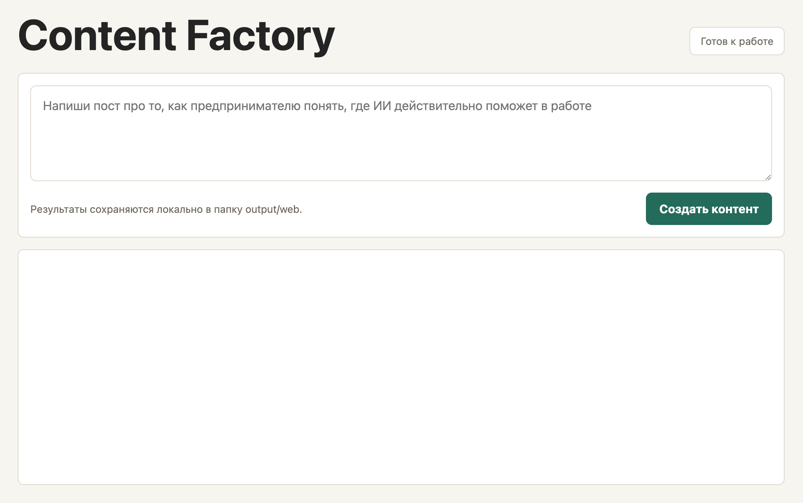
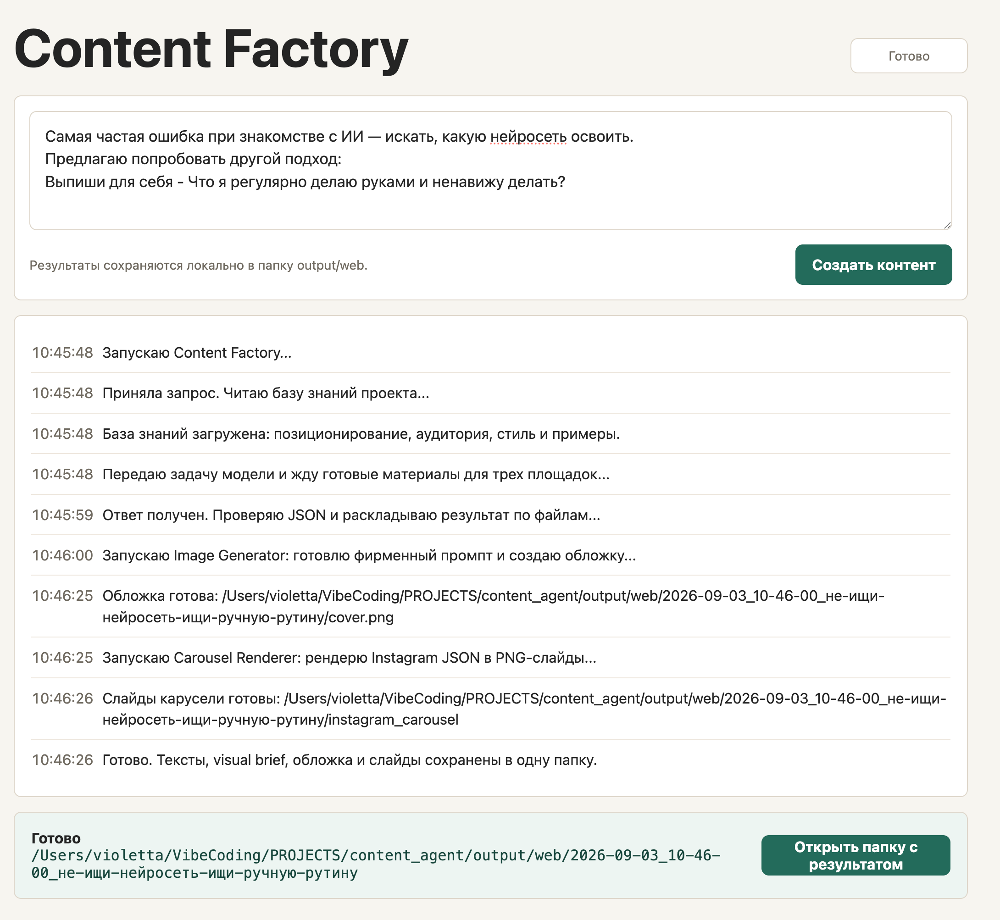
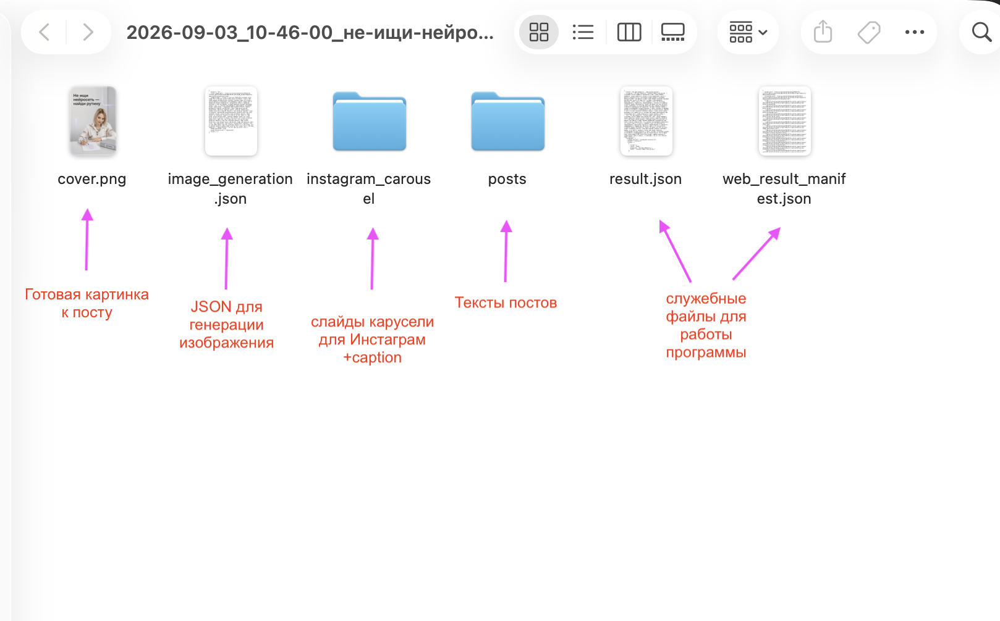
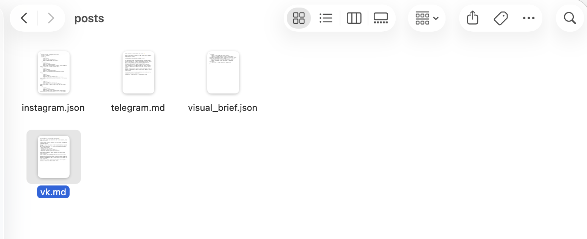
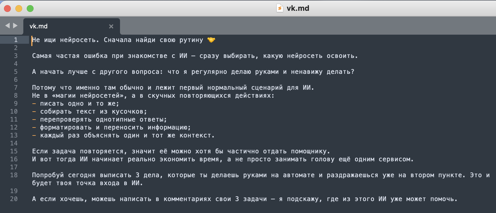
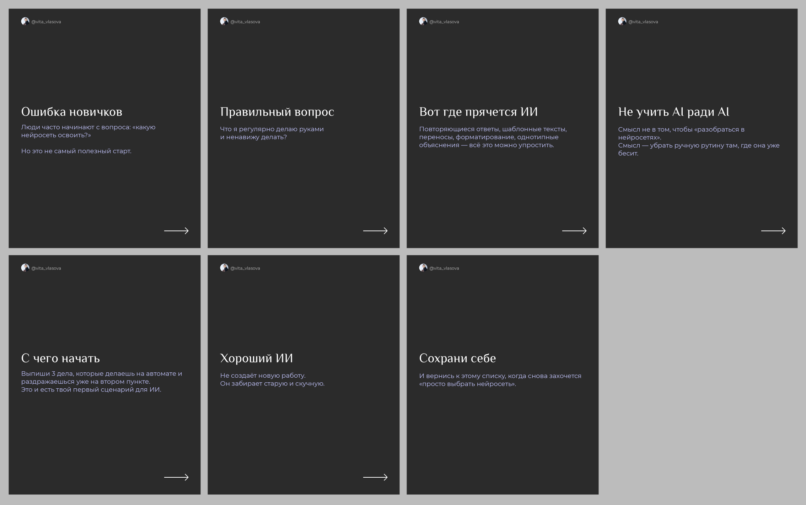
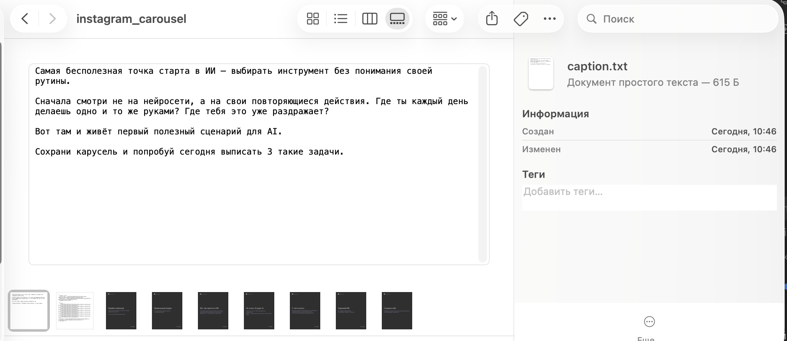
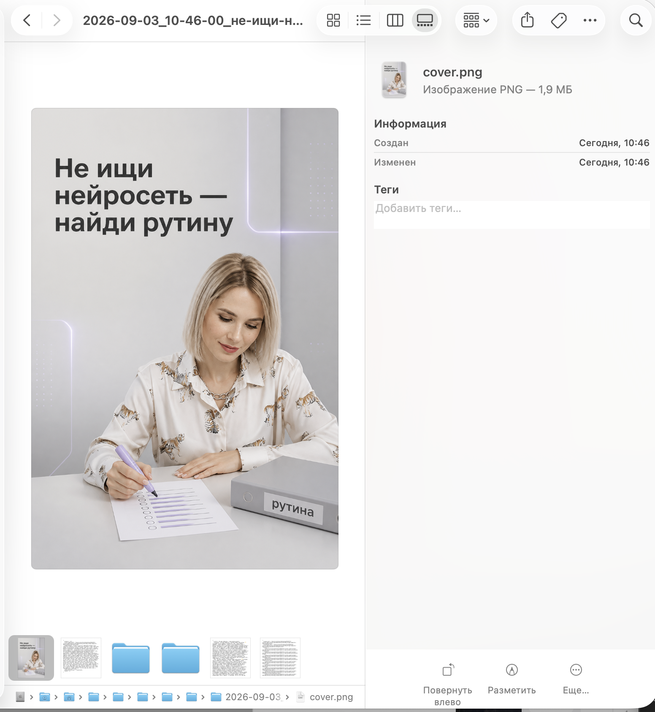
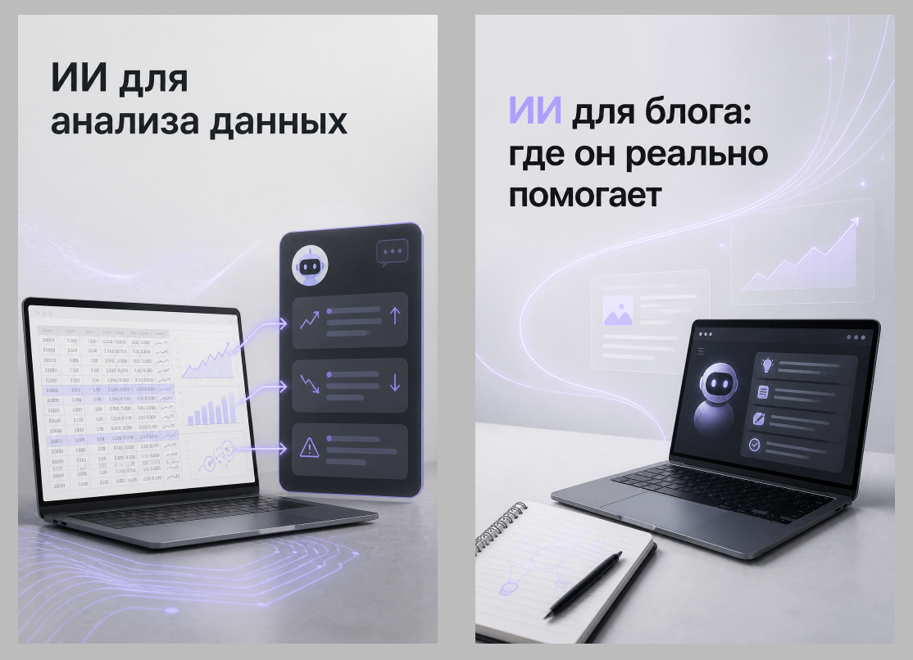

# Content Factory

Content Factory — локальный ассистент для подготовки контента: постов для Telegram, VK и Instagram* (тексты + картинки).

Проект хранит персональную базу знаний, правила tone of voice, контентные workflow и вспомогательные скрипты, которые превращают тему в готовые материалы для разных площадок.


# О проекте

## Целевая аудитория

Эксперты, которые ведут свои соцсети и присутствуют на разных площадках.

## Какую проблему решает проект

У экспертов нет времени вести соцсети. Работа занимает большую часть времени, а на контент времени и сил не остается.
Необходимо присутствовать на многих площадках - контент можно дублировать, но важно учитывать особенности конкретных соцсетей.
Нет возможности платить за услуги СММ.

## Задача

Превращать заметку, идею или сырой текст в посты для моих соцсетей ВКонтакте, Инстаграм, Телеграм.

## Что получаем на выходе:
 - текст для публикации во ВКонтакте
 - текст для публикации в Телеграм
 - картинка к посту
 - Инстаграм - слайды для карусели + текст подписи

Все материалы готовы к публикации, учитывают стиль написания текстов, визуал также создан в едином фирменном стиле эксперта.

## Основной пайплайн:
 1. Я ввожу короткую заметку или идею поста в web-интерфейсе.
 2. Проект читает базу знаний: моё позиционирование, аудиторию, тон общения, правила и примеры контента.
 3. ИИ готовит материалы под три площадки: Telegram, VK и Instagram, а также visual brief для визуала.
 4. По visual brief создаётся обложка. Если в визуале нужен человек, используются фото-референсы из assets/me/.
 5. Из Instagram-материала автоматически рендерится карусель в PNG-слайды.
 6. Всё сохраняется в отдельную папку внутри output/web/: тексты, JSON-файлы, обложка и слайды карусели.

# Техническое описание

## Что умеет

- Создает адаптированные посты для Telegram, VK и Instagram.
- Использует локальную базу знаний: позиционирование, аудиторию, tone of voice, правила контента и фирменный стиль.
- Готовит visual brief для создания изображения к посту.
- По visual brief генерирует картинку к посту в заданном фирменном стиле (шрифты, цвета, атмосфера)
- Если на изображении согласно visual brief присутствует человек, то это фото эксперта (скрипт берет референсы и генерирует максимально похожего персонажа)
- Рендерит слайды Instagram-карусели из структурированного JSON.
- Оставляет публикацию ручной: проект готовит файлы, но не публикует их в соцсети.


## Структура проекта

```text
content_agent/
├── CLAUDE.md        # Основные инструкции агента и workflow проекта
├── README.md        # Описание проекта и локального web-интерфейса
├── web_app.py       # Локальный сервер для demo-интерфейса
├── knowledge/       # База знаний и правила контента
│   ├── about-me.md          # Позиционирование и проекты автора
│   ├── audience.md          # Сегменты и потребности целевой аудитории
│   ├── brand-style.md       # Принципы визуального стиля бренда
│   ├── content-guide.md     # Правила подготовки контента
│   ├── examples-posts.md    # Примеры публикаций
│   └── tone-of-voice.md     # Тон и стиль коммуникации
├── scripts/         # Скрипты автоматизации для изображений и каруселей
├── web/             # Статический frontend demo-интерфейса
│   └── index.html   # Интерфейс проекта
├── assets/          # Локальные ассеты: шрифты и фото-референсы
├── draft/           # Черновики и идеи контента
├── output/          # Сгенерированный контент, игнорируется git
│   └── web/         # Результаты работы через web-интерфейс
└── tmp/             # Временные локальные файлы, игнорируются git
```

## Приватные и локальные файлы

Репозиторий намеренно игнорирует локальные и персональные материалы:

- `.env`
- `.claude/settings.local.json`
- `assets/me/`
- `output/`
- `tmp/`
- файлы Python cache


## Текущий статус

Текущая версия — рабочий локальный content pipeline. Проект работает через локальный веб-интерфейс.
Следующий возможный этап развития — использовать эту web/local-версию как основу для desktop-приложения или закрытый web-сервис.


# Демонстрация работы

## Запускаем локальный web-интерфейс:

```bash
python3 web_app.py
```

После запуска открываем:

```text
http://127.0.0.1:8000
```



На странице можно ввести запрос на создание контента, увидеть процесс генерации и открыть локальную папку с результатом после завершения работы.




## Смотрим результат:

Сразу по кнопке переходим в папку с результатом




Тексты постов для ВК и Телеграм




Пример готового текста для ВК



Слайды для публикации в Инстаграм в едином стиле и текст надписи для карусели





Обложка для поста



## Отдельно про визуал:
Все картинки к постам генерируются в фирменном стиле и цветах моего блога. Стиль описан в файле web_app.py внутри функции build_image_prompt.



Также, поскольку у меня экспертный блог, мне захотелось, чтобы на картинках к постам была я, если там изображен человек.
Мне удалось добиться максимального сходства, загрузив свои референсные фото в assets/me и прописав в промпте требование создать женщину с моей внешностью и сохранить узнаваемость по референсным фото, если в Visual Brief встречается признак человека.


# Монетизация
Далее такой продукт можно продавать как отдельную услугу  - “Контент-завод под твою нишу” - основа уже есть, нужна будет только доработка под каждого конкретного клиента.
Также такой контент-завод можно доработать и под соцсети бизнеса, а не только экспертов, поскольку он уже умеет работать с фирменным стилем.

(*)Instagram - продукт компании Meta, запрещенной на территории РФ.
